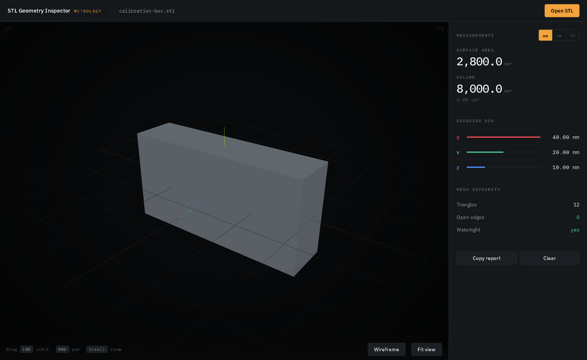

# STL Geometry Inspector

Browser-based geometric analysis of STL meshes. Drop in a part and read its
surface area, volume, bounding box and watertightness. One HTML file, no build
step, and the file never leaves the browser.



This began as the geometry engine behind a 3D-printing quote tool: the customer
uploads a part, the page measures it, and the price follows from the volume.
That measurement layer is the useful, reusable half, so this repository is only
that — the analysis, with the pricing and the order flow taken out.

---

## Run it

The page loads ES modules, so it needs an HTTP server. Opening `index.html`
from the filesystem gives a blank screen and a CORS error in the console.

```bash
python -m http.server 8124
```

Open <http://localhost:8124>. There is nothing to install and no API key: the
only network request is Three.js from a CDN.

It is a static site, so it also runs on GitHub Pages straight from this
repository. `.github/workflows/pages.yml` publishes the root on every push to
`main`. Enable it once under **Settings → Pages → Source → GitHub Actions**.

| Key | Action |
|---|---|
| Drag `LMB` | Orbit |
| Drag `RMB` | Pan |
| `Scroll` | Zoom |
| `F` | Fit the view to the part |
| `W` | Toggle wireframe |

---

## What it measures

**Surface area.** Half the magnitude of the cross product of two edges, summed
over every triangle.

**Volume.** Each triangle forms a tetrahedron with the origin. Summing those
signed volumes cancels the outside contributions and leaves the enclosed
volume. This is exact for a closed surface and meaningless for an open one,
which is why the mesh is checked before the number is trusted.

**Bounding box.** Axis-aligned extents on X, Y and Z, colour-keyed in the panel
to the gizmo in the viewport.

**Watertightness.** Every edge of a closed surface is shared by exactly two
triangles. The inspector hashes all three edges of every triangle and counts
those used only once. Zero means the surface closes. Anything else is reported,
and the volume figure is flagged as unreliable rather than quietly shown.

> An STL carries no unit. Millimetres are the convention, so mm is the base and
> the cm and inch readouts are conversions of that assumption.

---

## Verify it

`samples/calibration-box.stl` is a 40 × 20 × 10 mm box written from known
values, so the expected output is arithmetic rather than opinion:

| Property | Expected |
|---|---|
| Surface area | 2,800.00 mm² |
| Volume | 8,000.00 mm³ (8.00 cm³) |
| Bounding box | 40.00 × 20.00 × 10.00 mm |
| Triangles | 12 |
| Open edges | 0 — watertight |

Switching to inches should give 0.4882 in³, which is 8000 / 16387.064.

---

## Built with

Three.js 0.160 and its `STLLoader` and `OrbitControls` addons, loaded from a CDN
as plain ES modules. No bundler, no dependencies to install. Type is IBM Plex
Sans and IBM Plex Mono.

## License

MIT — see [LICENSE](LICENSE).
